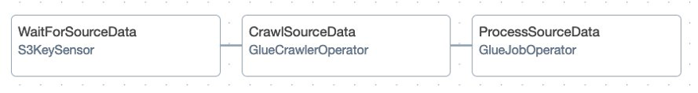
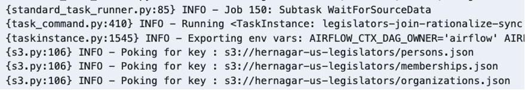
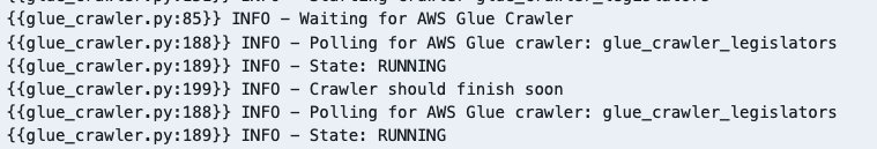
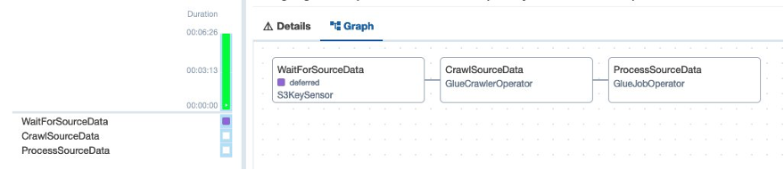

# Using deferrable operators in Amazon Managed Workflows for Apache Airflow

Using deferrable operators in Amazon MWAA requires the following:

1. An Amazon MWAA environment running Apache Airflow version v2.7.2 or greater, and
2. A deferrable version of an operator or sensor in your DAG’s tasks. AWS deferrable operators expose a `deferrable` parameter. By default, `deferrable` is set to `False`, set this to `True` to run the operator in asynchronous mode. Apache Airflow Providers for Amazon v8.3.0 added deferrable modes to many of the AWS operators like Amazon Athena, Amazon EMR, and AWS Glue.

Follow the steps below to understand how deferrable operators work together. You will be building and orchestrating the following data pipeline:



* A S3KeySensor that waits for a dataset to be uploaded in Amazon Simple Storage Service (Amazon S3)
* An AWS Glue Crawler to classify objects in the dataset and save schemas into AWS Glue Data Catalog
* An AWS Glue Job that uses the metadata in the Data Catalog to de-normalize the source dataset, create Data Catalog tables based on filtered data, and write the resulting data back to S3 in separate Apache Parquet files

For its purposes, this example reuses components in [this programming guide](https://docs.aws.amazon.com/glue/latest/dg/aws-glue-programming-python-samples-legislators.html). It uses a dataset from [everypolitician.org](https://everypolitician.org) that contains data in JSON format about United States legislators and the seats that they have held in the US House of Representatives and Senate. It is composed of three files: `persons.json`, `organizations.json`, and `memberships.json`.

## Setup

### Pre-requisites

1. Create two Amazon Simple Storage Service (Amazon S3) buckets
    * One bucket to store the raw source dataset and the AWS Glue python script to be used, i.e. `source_bucket`
    * One bucket to store the processed dataset, i.e. `target_bucket`
2. Add permissions to the Amazon MWAA environment execution role to read from `source_bucket`, and read and write to `target_bucket`
3. Create an IAM Role to grant AWS Glue access to read from `source_bucket`, read and write to `target_bucket`, and AWS Glue Catalog Database and Tables, i.e. `AWSGlueRoleLegislators`
4. Upload the sample DAG `join-relationalize.py` to your Amazon MWAA environment DAGs folder
5. Download and unzip the file `source-dataset.zip` containing the dataset to use
6. Download the file `glue-script-join-relationalize.py`, and upload it to `source_bucket`

### Execution steps

1. Trigger your DAG with the required configuration parameters. You can use the template below:

```json
{
    "source_bucket_name": "source_bucket",
    "target_bucket_name": "target_bucket",
    "glue_db_name": "legislators",
    "glue_role_arn": "arn:aws:iam::XXXXXXXXXXXX:role/AWSGlueRoleLegislators",
    "glue_role_name": "AWSGlueRoleLegislators"
}
```

Once the DAG is running, check task `wait_for_source_data` logs. You can see it is using worker resources just poking Amazon S3 waiting for the source files.



2. You can proceed and upload the files `memberships.json`, `organizations.json`, and `persons.json` to `source_bucket`, so the DAG can move to the next task.

3. Check the tasks logs. For the tasks `crawl_source_data` and `process_source_data`, you are going to observe the same behavior: the tasks running, occupying full workers slots while only waiting for external systems (Glue Crawler and Glue Job) to complete their execution.



4. Edit the three operators in your DAG to use their asynchronous or deferrable versions. To use deferrable operators, Amazon Provider classes expose a `deferrable` parameter in those operators which support deferrable execution. By default, `deferrable` is set to `False`, set this to `True` to run operators in asynchronous mode. For example:

```python
wait_for_source_data = S3KeySensor(
    task_id="WaitForSourceData",
    bucket_name=SOURCE_BUCKET_NAME,
    bucket_key=["persons.json", "memberships.json", "organizations.json"],
    aws_conn_id="aws_default",
    deferrable=True
)
```

5. Before the next run, remove the folders `output-dir` and `temp-dir` in `target_bucket`.

6. Trigger your DAG with the same configuration parameters. Once the DAG is running, you can observe the tasks entering the new state `deferred`. For example, if you check `wait_for_source_data` logs, you are going to find the entry below.

`{taskinstance.py:1415} INFO - Pausing task as DEFERRED`

Also, in the Grid view, you can go to the tasks Graph and identify the same state.



During this time, worker slots are not being used by the task for poking/polling operations, meaning there’s extra capacity to run something else, optimizing your MWAA environment resource consumption.

### Versions Supported

Apache Airflow 2.7.2 on Amazon MWAA.

### Files

1. source-dataset.zip
2. glue-script-join-relationalize.py
3. join-relationalize.py

### Requirements.txt needed

None

### Plugins needed

None

## Explanation

For easier readability, the respective DAG file code has inline comments to help with explanation.

## Security

See [CONTRIBUTING](../blob/main/CONTRIBUTING.md#security-issue-notifications) for more information.

## License

This library is licensed under the MIT-0 License. See the [LICENSE](../blob/main/LICENSE) file.
