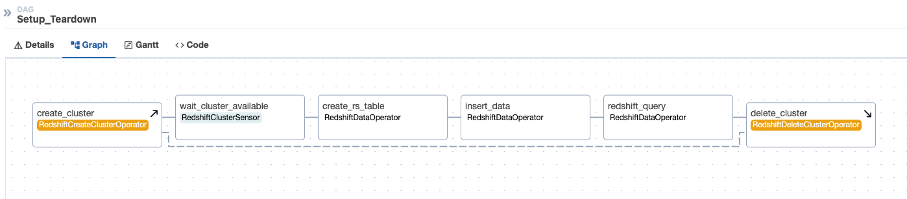
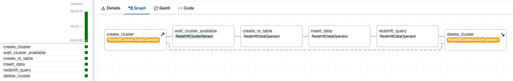
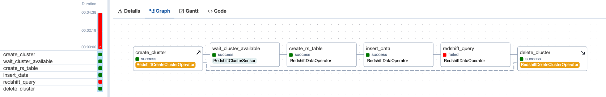

## Using setup and teardown operators in Amazon Managed Workflows for Apache Airflow

Using setup and teardown operators in Amazon MWAA requires the following:

1. An Amazon MWAA environment running Apache Airflow version 2.7.2 or greater, and
2. Setup and teardown tasks defined in the DAG file

You will be building the following data pipeline to understand how setup and teardown tasks work. In this DAG we have configured create_cluster as the upstream task and delete_cluster as the downstream task.



* RedshiftCreateClusterOperator is used to create a Redshift cluster
* RedshiftClusterSensor checks the cluster status every 15 seconds for 15 minutes till it is in available state
* A table is created in the Redshift cluster, data is inserted and queried using RedshiftDataOperator
* Finally the cluster is deleted using RedshiftDeleteClusterOperator

### Versions Supported
Apache Airflow 2.7.2 on Amazon MWAA.

### Setup 
**Pre-Requisites**
1. Add permissions to the Amazon MWAA environment execution role to access Amazon Redshift
2. Store the Redshift master username and password securely in AWS Secrets manager or Environment variables
3. Upload the sample DAG setup_teardown.py to your Amazon MWAA environment DAGs folder
4. Notice the Grid view in the Airflow UI as it shows the upwards arrow for setup and downwards arrow for the teardown task and the dotted line between setup and teardown task. Also notice how the DAG dependencies are defined within setup_teardown.py:

```create_cluster >> wait_cluster_available >> create_rs_table >> insert_data >> task_query >> delete_cluster.as_teardown(setups=create_cluster)```

**Steps**
1. Manually trigger your DAG with id `setup_teardown` from the Airflow UI
2. Wait for the execution to complete. Review the logs and confirm the DAG is marked as success.  



3. Next make the below changes to your DAG for “task_query”, save and re-upload the DAG to dags folder in S3 bucket.

```
task_query = RedshiftDataOperator(
        task_id='redshift_query',
        cluster_identifier='redshift-cluster-test',
        database='test',
        db_user="awsuser",
        aws_conn_id="aws_default",
        sql=""" select * from dev.public.cities""",
        wait_for_completion=True,
        dag=dag
    )
```

4. Manually trigger the DAG `setup_teardown` from the Airflow UI
5. Notice that even if redshift_query task fails, the delete_cluster task still runs and the DAG run is marked as failed



### Files

1. setup_teardown.py

### Requirements.txt needed
None

### Plugins needed 
None

### Explanation
For easier readability, the respective DAG file code has inline comments to help with explanation.

## Security

See [CONTRIBUTING](https://github.com/aws-samples/amazon-mwaa-examples/blob/main/CONTRIBUTING.md) for more information.

## License

This library is licensed under the MIT-0 License. See the [LICENSE](https://github.com/aws-samples/amazon-mwaa-examples/blob/main/LICENSE) file.
