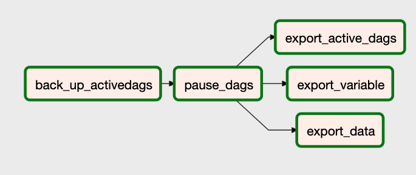
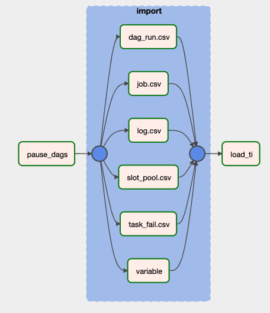

## Airflow sample migration scripts

Metadata migration scripts in the folder are sample scripts to migrate to a new Amazon MWAA environment manually.
This will load only DAG history[dag_run, task_intance, job, task_fail], pools, audit and variables. With Amazon MWAA, The dag tables like Dag, Dag_tag, Dag_code are automatically populated with Dag files from S3 Dags folder. Permission related tables such as ab_permission, ab_role are populated based on IAM permissions. If you need any additional tables than the automatically populated, You need to modify the scripts.

## Thing to know before you start the migration
- Folders are structured to reflect from and to versions of Airflow.
- If you are migrating from self-managed Airflow and are using a different database than Postgres, You have to change the export script. The scripts are built for Postgres database.
- If you are using a different version of Airflow than what is in here, You might change the export.py to reflect all the changes required for the version based on [databases changes](https://github.com/apache/airflow/blob/0ebd6428e6b484790bfbbe1b8687ef4e6cae10e9/docs/apache-airflow/migrations-ref.rst) that happened from that version onwards.
- Dags in the old environment are paused before and after running the export. The current active dag list is exported to S3 if you want to refer later when unpausing in the new environment
- The Dags in the new environment are left in paused state. This is to avoid sudden spike in the dag runs depending on the dag history. You can refer to the exported active_dags file for previously active dags in the old environment.
- When you have many DAGs, It might be a good practice to migrate them in batches. You can modify the export.py to include only the dags you are migrating.
- It is a good practice to migrate only the recent history than everying from the old environment. You can modify the export.py to include the datetime from which you want to migrate the history.
- When you migrate from one MWAA environment to another environment, The cloudwatch task info logs are copied as well. Import script copies only the failed task info logs. If you want to copy all the task info, you can modify the query in the **getDagTasks** function.
- If you do not want to copy the task info log, remove the **load_CW_logs** from task dependancy.

## How to use

Follow the instructions in the [migration guide](https://docs.aws.amazon.com/mwaa/latest/migrationguide/)

#### Graphical view of export in 1.10.12

#### Graphical view of import in 2.2.2

## Reference

- [Airflow database migration reference](https://github.com/apache/airflow/blob/0ebd6428e6b484790bfbbe1b8687ef4e6cae10e9/docs/apache-airflow/migrations-ref.rst)