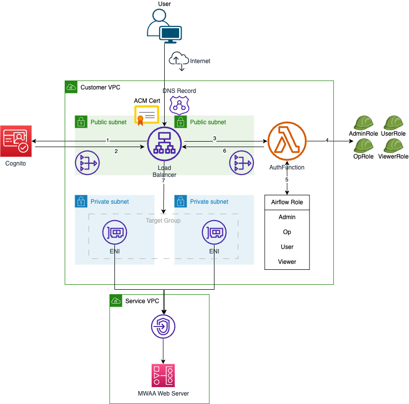
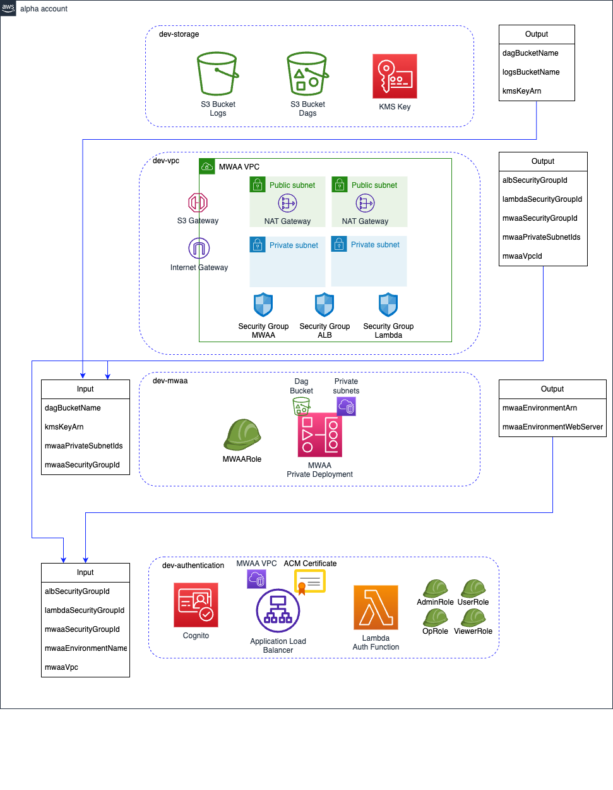

# Amazon MWAA deployment in private AWS VPC incorporated with Amazon Cognito Authentication using AWS CDKv2

## Summary
The purpose of this solution is to increase the **Scalability** by using serverless components and autoscaling infrastructure. **Reduce Maintenance** effort by introducing MWAA as a managed service which will orchestrate workflows to run ETL jobs and data pipelines. Improvement of **Monitoring** by centralizing log capturing and management into one managed service, AWS CloudWatch, which makes it easy for users to troubleshoot the solution.

### Prerequsites & Limitations
This project uses AWS CDK v2 based on TypeScript. The developer's laptop/computer should have the following software:
* [AWS CDK v2](https://docs.aws.amazon.com/cdk/latest/guide/getting_started.html)
* [cfn_nag](https://github.com/stelligent/cfn_nag)
* [Node.js](https://nodejs.org/en/download/)
* [TypeScript](https://www.typescriptlang.org/)

## Architecture

The [CDK code attached to this article](https://gitlab.aws.dev/zarudk/mwaa) deploys the following architecture



Users access the MWAA home page through the Application Load Balancer (ALB) endpoint (HTTP). The ALB routing rules work as follows:
1. If the user is not already authenticated, the ALB redirects the user to the Cognito login page. The user must then provide
credentials that correspond to an existing Cognito user, part of a Cognito group in the Cognito user pool.
2. When the user logs in, Cognito returns session data to the ALB.
3. The ALB triggers the **AuthFunction** Lambda function and forwards Cognito output.
4. Based on Cognito group membership, this function assumes a specific IAM role. For example, if the Cognito user is part of the
Cognito **Admin** group, the Lambda function assumes the IAM role **AdminRole**. Each IAM role has the permission to
generate an [Airflow web token](https://docs.aws.amazon.com/mwaa/latest/userguide/call-mwaa-apis-web.html) for the corresponding
Airflow role.
5. Once it assumed the IAM role, the Lambda function generates the Airflow web token for the corresponding role. For example,
if the Lambda function assumed the AdminRole IAM role, it then generates a web token for the Admin [Airflow role](https://airflow.apache.org/docs/apache-airflow/1.10.9/security.html#default-roles).
6. The Airflow web token is sent back to the ALB.
7. The ALB adds the Airflow web token to the MWAA login endpoint, and the user lands on the MWAA home page with the appropriate Airflow role.

Note that these steps happen in a few seconds without any user operation, except for the Cognito login.


## Installation
You can use this pattern to accelerate the deployment of your own solution. When doing so you can:
1. Configure the ALB to listen on the 443 port (HTTPS), after providing a DNS record and a certificate.
2. Extend the solution to support additional roles, compared to what [Airflow propose by default](https://airflow.apache.org/docs/apache-airflow/1.10.9/security.html#default-roles).
This will help you adapt the solution to meet your security requirements.


### MacOS or Linux

If you are using macOS, you can install the prerequisites by running the following command in your preferred terminal. On Linux, you can use the respective package manager or [Homebrew for Linux](https://docs.brew.sh/Homebrew-on-Linux):

```bash
brew install node
brew install git-remote-codecommit
brew install ruby brew-gem
brew-gem install cfn-nag
```

### AWS Cloud9

If you are using [AWS Cloud9](https://aws.amazon.com/cloud9/), you can use the following command to install the prerequisites:

```bash
gem install cfn-nag
```

Note: Cloud9 should have Node.js and npm installed. You can check the installation or version by running the following commands:

```bash
node -v
npm -v
```

## Development process via Makefile

To simplify the development process and provide the ability to run tests locally, we use a Makefile. The Makefile has the same steps as the CodeCatalyst CI/CD pipeline. A developer can execute the whole pipeline locally by running the command `make`, or execute individual steps.

* Execute the local pipeline: `make`
* Install all components and packages: `make install`
* Build the project: `make build`
* Fix linting errors in the project: `make linting`
* Execute unit testing: `make unittest`
* Run security checks: `make security`
* Deploy to the current account: `make deploy`
* Clean up the environment: `make clean`


## Deployment



To deploy the infrastructure, use the following commands:

1. To create a test certificate, run the following command:
```bash
openssl req -x509 -newkey rsa:2048 -keyout ./key.pem -out ./cert.pem -sha256 -days 1200 -nodes -subj "/C=DE/ST=StateName/L=CityName/O=CompanyName/OU=CompanySectionName/CN=*.elb.amazonaws.com"
```

2. Import the certificate into the AWS account and store the ARN as an ENV variable:
```bash
cert_arn=$(aws acm import-certificate --certificate fileb://cert.pem --private-key fileb://key.pem --query "CertificateArn" --output text)
export CERTIFICATE_ARN=${cert_arn}
echo "The certificate ARN is: ${CERTIFICATE_ARN}"
```

If you already have a certificate, you can import it with the following commands:
```bash
cert_arn=$(aws acm list-certificates --query "CertificateSummaryList[?DomainName=='*.elb.amazonaws.com'].CertificateArn" --output text)
export CERTIFICATE_ARN=${cert_arn}
echo "The certificate ARN is: ${CERTIFICATE_ARN}"
```

3. Build and deploy the solution to your AWS account:
```bash
make build
make deploy
```

4. After successful deployment, you should see the following outputs:
```bash
dev-external: creating CloudFormation changeset...

 ✅  dev-external

✨  Deployment time: 23.86s

Outputs:
dev-external.CognitoUserPoolId = eu-west-1_12345678
dev-external.ExternalURL = https://mwaa-0123456789.eu-west-1.elb.amazonaws.com
```

You need to create the first test user in the Cognito User Pool and then try to open the External URL page.

5. To create a user in the Cognito pool, use the following command:
```bash
COGNITO_USER_POOL_ID=$(aws cloudformation describe-stacks --stack-name dev-external --query "Stacks[0].Outputs[?OutputKey=='CognitoUserPoolId'].OutputValue" --output text)
USER_NAME="test"
TEMP_PASS="Test123@" # Set your password!
aws cognito-idp admin-create-user --user-pool-id "${COGNITO_USER_POOL_ID}" --username "${USER_NAME}" --temporary-password "${TEMP_PASS}"
```

6. Copy the URL from the ExternalURL output and open it in your browser. You may see a certificate warning. Accept the risk and open the page. You should see a login page with authentication.
Enter the username and password you created before. After changing the password, you should be able to log in to the MWAA environment.
```bash
EXTERNAL_URL=$(aws cloudformation describe-stacks --stack-name dev-external --query "Stacks[0].Outputs[?OutputKey=='ExternalURL'].OutputValue" --output text)
echo "${EXTERNAL_URL}"
```
