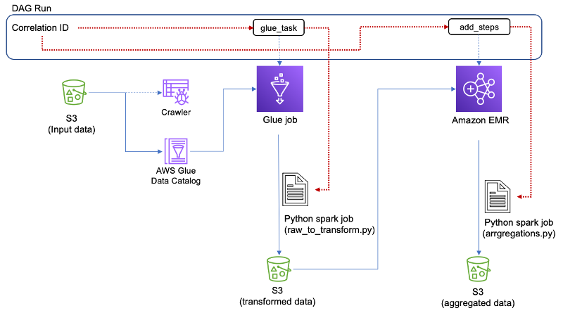

# Improve Observability across MWAA tasks

Observability across the different processes within the data pipeline is a key component to monitor the success and/or failure of the pipeline. While scheduling the execution of tasks within the data pipeline is controlled by Airflow, the execution of the task itself (transforming, normalizing and/or aggregating data) is done by different services based on the use case. Having an end-to-end view of the data flow is a challenge due to multiple touch points in the data pipeline.

The DAG file and scripts in this project define how we can use a correlation_id across tasks within a DAG. Having the unique identifier helps improve the end-to-end observability for a DAG run. It helps to reduce the time to look through different log sources and enables for faster troubleshooting of a DAG run.

Refer to the following ['blog']() for more detials <link to be provided>

## Architecture 

## Prerequistes for Deployment
Execute the ['MWAA analytics workshop'](https://catalog.us-east-1.prod.workshops.aws/workshops/795e88bb-17e2-498f-82d1-2104f4824168/en-US) and then use the scripts present in the github repo to gain more observability of your DAG run

- Place the DAG file 'data_pieplie.py' in the S3 bucket 'dags' folder 
- Place the script files in the S3 bucket 'scripts' folder

---

## License

This library is licensed under the MIT-0 License. See the [LICENSE](LICENSE) file.
