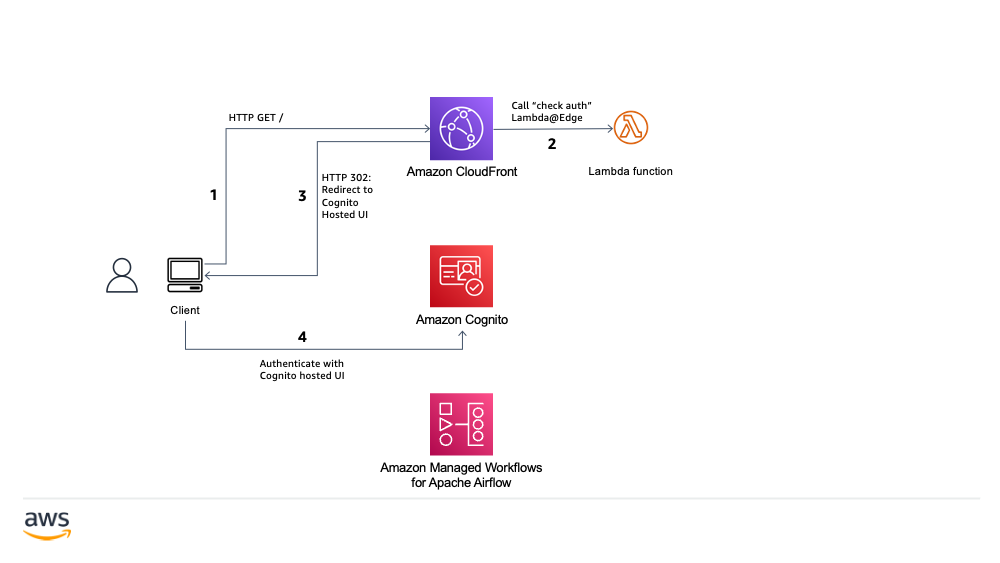
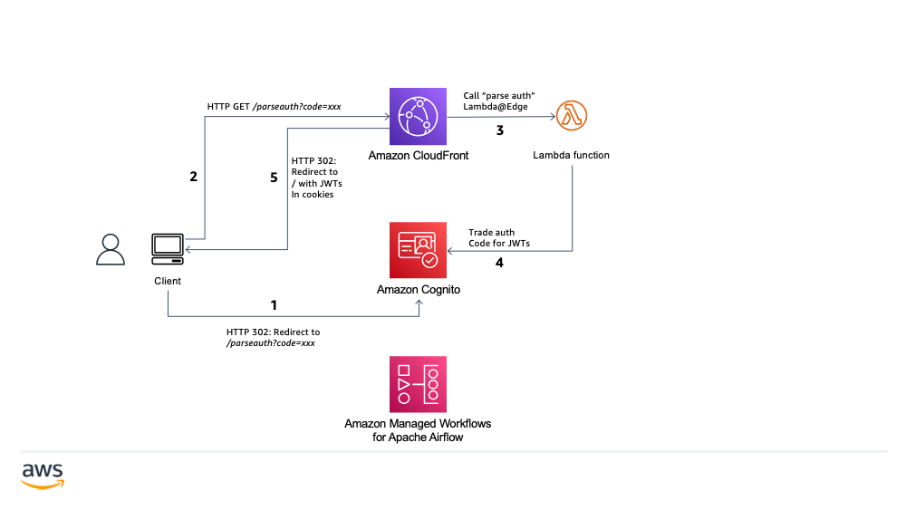
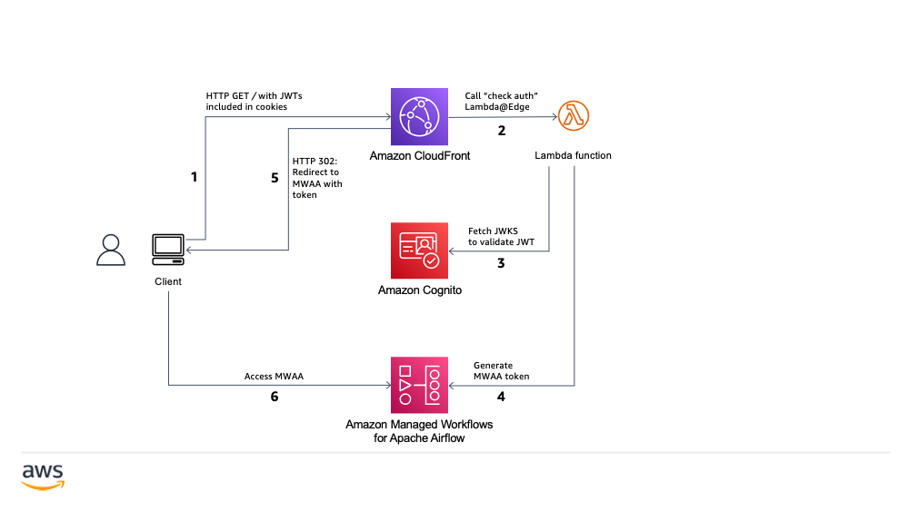

# amazon-mwaa-custom-domain-public-endpoint

Sample code to demonstrate using Amazon CloudFront, AWS Lambda@Edge, and Amazon Cognito to enable custom domain for a public MWAA deployment. This solution is built on code from samples repo below with minor updates.

https://github.com/aws-samples/cloudfront-authorization-at-edge

If you would like to set up a custom domain for a private MWAA deployment, refer to the technical guide below.

https://d1.awsstatic.com/whitepapers/accessing-a-private-amazon-mwaa-environment-using-federated-identities.pdf

## How it works

There are 3 main parts to the solution.

**Part 1:** The user attempts to access the custom domain mapped to a CloudFront distribution. A Lambda@Edge function is invoked that redirects to Cognito for authentication.

**Part 2:** The user authenticates and is redirected back to CloudFront. CloudFront verifies authentication using a Lambda@Edge function, and then sets cookies with JWTs.

**Part 3:** The user’s browser follows the redirect and reattempts to access the CloudFront distribution. Lambda@Edge validates that access is now authorized, by checking the JWTs in the cookies. It generates the MWAA token and redirects user to public MWAA endpoint.

### Part 1: Sign in attempt



1. The user tries to access the custom domain.

2. The CloudFront distribution has been configured with a “check auth” Lambda@Edge function that inspects every incoming request. The function checks the cookies in the request to see if they contain the user’s authentication information. The information isn’t there because the user hasn’t signed in yet, so the function redirects the user to sign in at the user pool’s hosted UI.

3. CloudFront responds with a redirect to the user pool’s hosted UI instead. The CloudFront response includes a state parameter that contains the originally-requested URL and a nonce. A nonce is a cryptographic construct that prevents Cross Site Request Forgery. The nonce is also stored in a cookie. (Besides the nonce, another cryptographic construct is involved for the PCKE part of the OAuth flow. For brevity, we’ll skip explaining that here.)

4. The user’s browser opens the user pool’s hosted UI, where the user signs in.

### Part 2: Authentication and verification



1. After the user signs in to the user pool’s hosted UI, Cognito redirects the user back to “/parseauth”. The redirect contains a query string that includes an authorization code. It also contains the state parameter that was passed in the redirect to Cognito in Part 1.

2. The user’s browser follows the redirect by accessing the “/parseauth” URL and includes the query string. The cookie with the nonce (set in Part 1) is passed along with the request.

3. The CloudFront distribution has been configured with a “parse auth” Lambda@Edge function that is configured to handle requests to “/parseauth”. This function gets the authorization code and state parameter from the query string of the request. Then it compares the nonce in the state parameter with the nonce in the cookie to make sure that they match.

4. The Lambda@Edge function invokes the user pool’s token API to exchange the authorization code in the request for JWTs. The JWTs are stored in cookies in the HTTP response. The Lambda@Edge function extracts the originally-requested URL from the state parameter (included in the query string) and prepares a redirect to that URL.

5. CloudFront returns the redirect to the user’s browser, setting cookies with JWTs.

### Part 3: Redirect and access



1. The user’s browser, following the redirect, tries again to access the domain. This time the request includes cookies with JWTs that were set earlier.

2. The “check auth” Lambda@Edge function—the same one that executed in Part 1—checks the cookies, and now the cookies include the JWTs. To validate these JWTs, the function requires the JSON Web Key Set (JWKS) from the user pool.

3. The Lambda@Edge function fetches the JWKS from the User Pool and validates the JWTs. 

4. If the JWTs are valid, the function generates the MWAA token fo web access and responds to CloudFront with a redirect to MWAA. Note that the fetched JWKS is cached in the Lambda function (outside the handler), so that it can be reused and won’t need to be fetched in subsequent invocations of the function.

5. Browser follows redirect to public MWAA endpoint with the token.

6. The user successfully accesses MWAA!

## Things to note

1. The `/refreshauth` path refreshes the ID and Access tokens when needed, using the Refresh token.

2. The `/signout` path signs the user out by expiring the tokens and signing out from the user pool.

3. MWAA is not configured as origin to CloudFront. The format of the MWAA endpoint is `https://<CUSTOM_DOMAIN>/aws_mwaa/aws-console-sso?login=true#<WEB_TOKEN>` and Lambda@Edge [cannot modify query string to add fragment](https://docs.aws.amazon.com/AmazonCloudFront/latest/DeveloperGuide/edge-functions-restrictions.html#lambda-at-edge-function-restrictions) (#). Instead the solution is redirecting the user to the MWAA domain with the token.

## Deploying the solution

### Pre-requisites

1. Request ACM certificate for the custom domain

2. AWS SAM CLI (tested with `1.37.0`)

3. Node (tested with `v17.5`)

4. Docker for SAM build (optional)

### Deployment steps

1. Clone the repository and run `npm install` to install dependencies. This solution can be deployed to any region that supports the services used. Custom Lambda resources will copy Lambda@Edge function codes to `us-east-1` for CloudFront. 

2. Open the CloudFormation template - `template.yaml` - in the root of the project and edit line 64 to specify your custom domain for security headers. For example, if your domain name is mydomain.com, line 64 will look as follows.

`"Content-Security-Policy": "default-src 'none'; img-src 'self'; script-src 'self' https://code.jquery.com https://stackpath.bootstrapcdn.com; style-src 'self' 'unsafe-inline' https://stackpath.bootstrapcdn.com; object-src 'none'; connect-src 'self' https://*.amazonaws.com https://*.amazoncognito.com https://*.mydomain.com"`

3. [Optional] This solution maps all authenticated users to the Airflow `User` profile by default. You can change this on line 154 in `template.yaml`.

4. Code is in TypeScript. Use `npm run build` to compile and run Webpack.

5. Run `sam build` to package the code

6. Copy `parameters.txt.sample` to `parameters.txt` and update the values based on your environment. Note that you need to change `Version` only if you wish to redeploy Lambda@Edge after initial deployment.

7. Deploy solution using command below.

```bash
sam deploy --parameter-overrides $(cat parameters.txt) --s3-bucket <S3 bucket to upload template> --stack-name public-mwaa-custom-domain --capabilities CAPABILITY_IAM --region <your region>
```

8. Update Route53 or your DNS provider to map custom domain to CloudFront domain. You can find instructions for Route53 [here](https://docs.aws.amazon.com/Route53/latest/DeveloperGuide/routing-to-cloudfront-distribution.html).

## Cleaning up

Follow the steps below if you wish to delete the solution.

1. **Important**: Remove the CNAME mapping for the custom domain from DNS provider. This is important before you delete CloudFront else you are left with a dangling domain which can be exploited by an attacker. Route53 has [built-in protection](https://docs.aws.amazon.com/Route53/latest/DeveloperGuide/protection-from-dangling-dns.html) against this.

2. The solution creates a bucket in us-east-1 named `public-mwaa-custom-domai-authedgedeploymentbucket-<randomstring>` to copy Lambda@Edge code in case template is deployed to a different region. Empty this bucket through the console or using command below.

`aws s3 rm s3://public-mwaa-custom-domai-authedgedeploymentbucket-<randomstring> --recursive`

3. Delete the main stack from console or using command below.

`sam delete --stack-name public-mwaa-custom-domain --region <your region>`

4. You will also have to delete the Lambda function CloudWatch logs. You can search for log groups that begin with the prefix `/aws/lambda/public-mwaa-custom`.

## TODO

1. This solution maps all authenticated users to the Airflow `User` profile by default. It does not leverage Cognito user groups for fine grained permissions.
