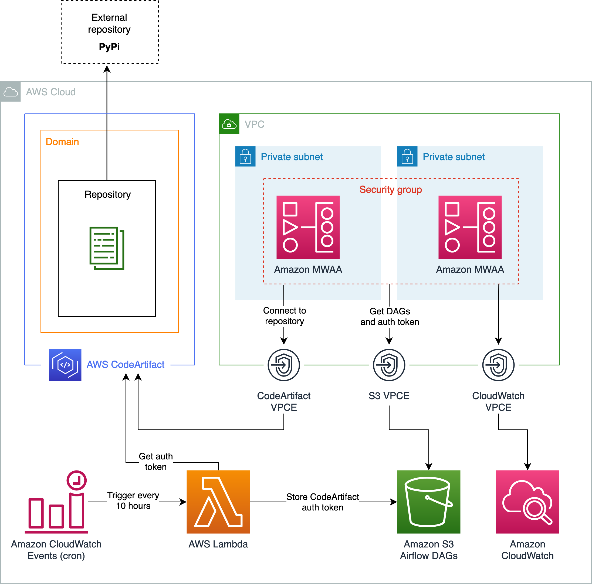

# Use AWS CodeArtifact with Amazon MWAA for Python dependencies

This project demonstrates how to create an [Amazon MWAA](https://aws.amazon.com/managed-workflows-for-apache-airflow/) environment that uses [AWS CodeArtifact](https://aws.amazon.com/codeartifact/) for Python dependencies. This enables users to avoid providing MWAA with an internet access via NAT Gateway and hence reduce the cost of their infrastructure.

[AWS Lambda](https://aws.amazon.com/lambda/) runs every 10 hours to obtain the authorization token for AWS CodeArtifact, which is then used to create `index-url` for `pip` remote repository (CodeArtifact repository). Generated `index-url` is saved to `codeartifact.txt` file that is then uploaded to an [Amazon S3](https://aws.amazon.com/s3/) bucket. MWAA fetches DAGs and `codeartifact.txt` at the runtime, and installs Python dependencies from the CodeArtifact repository.

---

## Architecture overview




## Repository structure

```
.
├── infra/                      // AWS CDK infrastructure 
├── mwaa-ca-bucket-content/     // DAGs and requirements.txt
├── lambda/                     // Lambda handler
├── .env                        // Environment variables
├── Makefile                    // Make rules for automation
```

## Deployment

Before moving on with the project deployment, complete the following checks: 

* Install [`npm`](https://www.npmjs.com/get-npm) on your machine
* Install [`Python`](https://www.python.org/downloads/) on your machine
* Ensure that [AWS CLI](https://docs.aws.amazon.com/cli/latest/userguide/install-cliv2.html) is installed and configured on your machine
* Ensure that [AWS CDK](https://aws.amazon.com/cdk/) is [installed and configured](https://docs.aws.amazon.com/cdk/latest/guide/getting_started.html#getting_started_prerequisites) on your machine

_**NOTE:** :warning: This project uses CDK library version `1.102.0`, hence the same version or higher is required._

### Python virtual environment

To create a virtual environment run the following `make` rule:

```sh
# from the root directory

$ make venv
```

This rule will create a virtual environment in `infra/venv` and install all the necessary dependencies. 

### Environment variables

Set environment variables in `.env` file.

* `AWS_REGION`: AWS region to which you wish to deploy this project
* `BUCKET_NAME`: choose a unique name for an Amazon S3 bucket that will contain Airflow DAGs
* `AIRFLOW_VERSION`: Apache Airflow version (`v1.10.12` or `v2.0.2`) - set to [the latest `v2.0.2`](https://docs.aws.amazon.com/mwaa/latest/userguide/airflow-versions.html)


### Deploy the infrastructure

Execute `deploy` rule to deploy the infrastructure:

```sh
# from the root directory

$ make deploy
```

_**NOTE:** :warning: AWS CDK CLI will ask for your permissions to deploy specific *IAM Roles* and *IAM Polices* resources. When asked, please acknowledge with `y` and press **Enter**._


### Clean up 

To destroy all resources created for this project execute the `destroy` rule:

```sh
# from the root directory

$ make destroy
```

_**NOTE:** :warning: AWS CDK CLI will ask for your permissions to destroy the CDK stacks. When asked, please acknowledge with `y` and press **Enter**._

## Add new Python dependencies

To install preferred Python dependencies to your MWAA environment, update the [`requirements.txt`](mwaa-ca-bucket-content/requirements.txt) file and upload it to S3 bucket. To make these changes take effect, you will need to update your MWAA environment by selecting a new version of `requirements.txt`. You can do so in AWS Console or via AWS CLI.

Upload `requirements.txt` with new Python dependencies:

```sh
aws s3 cp mwaa-ca-bucket-content/requirements.txt s3://YOUR-BUCKET-NAME/
```

To get `requirements.txt` versions run:

```sh
aws s3api list-object-versions --bucket YOUR-BUCKET-NAME --prefix requirements.txt
```

Finally, update your MWAA environment with a new version of `requirements.txt`:

```sh
aws mwaa update-environment --name mwaa_codeartifact_env --requirements-s3-object-version OBJECT_VERSION
```

If you build your own Python packages, you could also add this process to update `requirements.txt` and MWAA environment as part of your [release pipeline](https://docs.aws.amazon.com/codeartifact/latest/ug/using-python-packages-in-codebuild.html).

## License

This library is licensed under the MIT-0 License. See the [LICENSE](LICENSE) file.
