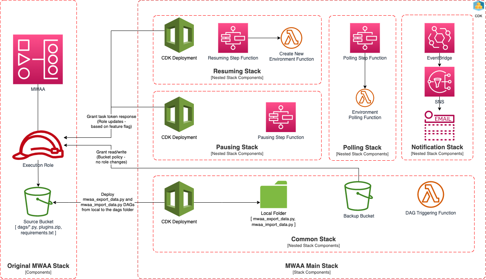
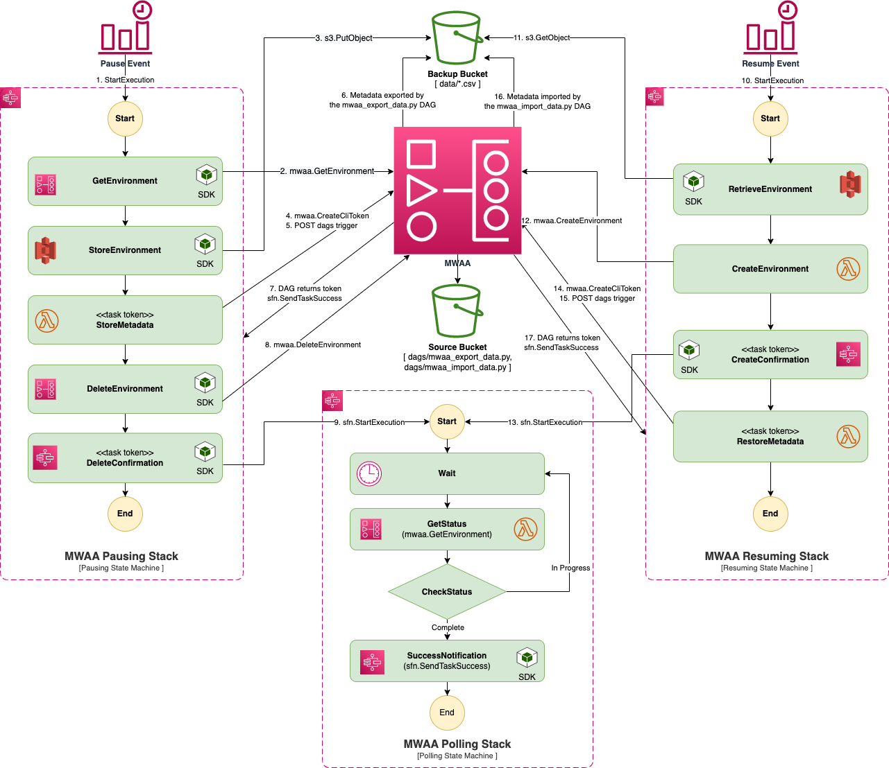

<!-- TOC ignore:true -->

# Automate Stopping and Starting an Amazon MWAA Environment using CDK

<!-- TOC ignore:true -->

# Contents

<!-- TOC -->

- [Introduction](#introduction)
- [Getting Started](#getting-started)
- [Architecture](#architecture)
  - [Deployment Architecture](#deployment-architecture)
    - [The Original MWAA Stack](#the-original-mwaa-stack)
    - [The Common Nested Stack](#the-common-nested-stack)
    - [The Polling Nested Stack](#the-polling-nested-stack)
    - [The Pausing Nested Stack](#the-pausing-nested-stack)
    - [The Resuming Nested Stack](#the-resuming-nested-stack)
    - [The Notification Nested Stack](#the-notification-nested-stack)
  - [Execution Architecture](#execution-architecture)
- [Prerequisites](#prerequisites)
- [Stack Parameters](#stack-parameters)
  - [Automated Update to the MWAA IAM Role](#automated-update-to-the-mwaa-iam-role)
  - [Automated Update to the VPC Security Group](#automated-update-to-the-vpc-security-group)
- [Building and Deploying the Project](#building-and-deploying-the-project)
  - [Cloning the Repository](#cloning-the-repository)
  - [Setting up Environment Variables](#setting-up-environment-variables)
    - [Create a .env file](#create-a-env-file)
    - [Export the variables in your shell](#export-the-variables-in-your-shell)
  - [Configuring Python Modules for MWAA](#configuring-python-modules-for-mwaa)
  - [Building the Project](#building-the-project)
  - [Deploying the Project](#deploying-the-project)
    - [Bootstrapping your Account](#bootstrapping-your-account)
    - [Launching the Stack](#launching-the-stack)
- [Limitations and Workarounds](#limitations-and-workarounds)
  - [Pausing While Active](#pausing-while-active)
  - [Stopping and Starting Multiple MWAA Environments](#stopping-and-starting-multiple-mwaa-environments)
  - [Not All MetaData Tables are Backed Up](#not-all-metadata-tables-are-backed-up)

<!-- /TOC -->

# Introduction

Amazon Managed Workflow for Apache Airflow ([MWAA](https://aws.amazon.com/managed-workflows-for-apache-airflow/))
is a managed orchestration service for [Apache Airflow](https://airflow.apache.org/). When an MWAA environment is created,
it remains up and running even when there aren't any tasks to process. It may be desirable to stop and start the environment
on an automated schedule to save on the idle time cost, especially, in a non-production environment. The project
contributes an AWS Cloud Development Kit ([CDK](https://aws.amazon.com/cdk/)) stack that can be deployed to the customer
account to automate stopping and starting the Amazon MWAA environment.

Here are some key features that this solution offers:

- Daylight savings aware schedules for stop and start
- Support for stopping and starting both public and private (customer vpc) environments
- Fully automated setup with externalized configurations
- Feature flag to opt in/out policy updates to the Identity and Access Management (IAM) execution role for Amazon MWAA environment
- Amazon Simple Notification Service (SNS) notification (email) for pause and resume successes and failures
- Infrastructure as Code (IaC) using AWS CDK

# Getting Started

The sample CDK application is provided as a part of the deployable solution of the blog post titled [Automating stopping and starting Amazon MWAA environment to save cost](https://aws.amazon.com/blogs/compute/automating-stopping-and-starting-amazon-mwaa-environments-to-reduce-cost/). Please review the blog post before proceeding further.

# Architecture

The AWS CDK stack essentially performs the following two functions:

1. stopping (dehydrate and delete) the Amazon MWAA environment, and
2. starting (create and rehydrate) a new Amazon MWAA environment

based on the customer specified schedule.

## Deployment Architecture

The main stack composes five nested stacks that perform various functions. The following diagrams details the
important components of these nested stacks:



### The Original MWAA Stack

This is the existing deployment of the Amazon MWAA environment. It should have three key components among others:

1. the Amazon MWAA environment itself
2. the execution role that the MWAA environment assumes
3. the source Amazon S3 bucket that hosts Ariflow DAGs, the plugins file, and the requirements file

### The Common Nested Stack

The nested stack performs the following functions:

1. It deploys two DAGS to the source S3 bucket: [mwaa_export_data](mwaairflow/assets/dags/mwaa_export_data.py)
   and [mwaa_import_data](mwaairflow/assets/dags/mwaa_import_data.py).
2. The [mwaa_export_data](mwaairflow/assets/dags/mwaa_export_data.py) DAG performs the dehydration logic by
   querying the MWAA metadata and storing the tables in the backup Amazon S3 bucket provided by the common stack.
3. The [mwaa_import_data](mwaairflow/assets/dags/mwaa_import_data.py) dag will rehydrate the MWAA environment
   by loading the data from the backup S3 bucket restoring them back to the metadata tables of the environment.
4. The common stack also deploys an AWS Lambda function that can trigger a given dag on the Amazon MWAA environment using
   the REST call for the [Airflow CLI](https://airflow.apache.org/docs/apache-airflow/stable/cli-and-env-variables-ref.html#trigger).
   This function is used by both the pausing and the resuming nested stacks.

### The Polling Nested Stack

At the time of writing, Amazon MWAA creation or deletion events were not available to Amazon EventBridge or AWS CloudTrail.
The polling stack provides AWS Step Functions to poll the Amazon MWAA environment for creation or deletion using the
[GetEnvironment](https://docs.aws.amazon.com/mwaa/latest/API/API_GetEnvironment.html) API call at a
user-defined frequency (60 seconds default). By default, the polling Step Functions times out after
60 mins (configurable).

### The Pausing Nested Stack

The pausing stack provides AWS Step Functions that orchestrates the dehydration and deletion of the
Amazon MWAA environment. The backup files are written to the backup Amazon S3 bucket shared by the common stack.
The pausing StepFunction uses the [task token integration](https://docs.aws.amazon.com/step-functions/latest/dg/connect-to-resource.html#connect-wait-token)
while triggering the [mwaa_export_data](mwaairflow/assets/dags/mwaa_export_data.py) dag, which needs
to return the token back to the AWS Step Functions through the
[SendTaskSuccess](https://docs.aws.amazon.com/step-functions/latest/apireference/API_SendTaskSuccess.html)
or [SendTaskFailure](https://docs.aws.amazon.com/step-functions/latest/apireference/API_SendTaskFailure.html)
API calls. The MWAA execution role in the original stack needs to grant these API call permissions
for the integration to work. The policy grant can be automatically applied by the pausing stack
deployment to the existing execution role if the `MWAA_UPDATE_EXECUTION_ROLE` environment
variable (feature flag) is set to `yes`. If the variable is set to `no`, then you will need to
manually add the required policy to the original execution role. We discuss more details in the
[Prerequisite](#prerequisite) section.

### The Resuming Nested Stack

The resuming stack provides another StepFunction that orchestrates the creation and rehydration of
the MWAA environment. Similar to the [pausing](#the-pausing-nested-stack) stack, it also uses the
[task token integration](https://docs.aws.amazon.com/step-functions/latest/dg/connect-to-resource.html#connect-wait-token)
while triggering the [mwaa_import_data](mwaairflow/assets/dags/mwaa_import_data.py) dag and needs
the policy update to the original MWAA execution role. We discuss more details in the
[Stack Parameters](#stack-parameters) section.

### The Notification Nested Stack

The notification stack sets up Amazon SNS email subscriptions for any status changes to the pausing and resuming
AWS Step Functions. An Amazon EventBridge rule is setup to send the Step Functions event notification to the configured
SNS topic.

## Execution Architecture

The diagram that follows depicts the execution of the stopping (pausing) and starting (resuming) functionality:



Both the pause and resume Step Functions are triggered by the
[Amazon EventBridge Scheduler](https://docs.aws.amazon.com/scheduler/latest/UserGuide/what-is-scheduler.html)
at a provided pause and resume schedules, respectively. The steps that show SDK, use the direct
[AWS SDK integrations](https://docs.aws.amazon.com/step-functions/latest/dg/connect-to-services.html)
calls and the ones that show AWS Lambda make those calls using the AWS Lambda functions. The numbered
arrows in the diagram shows the dependencies in the order of execution.

# Prerequisites

Here are the software prerequisites:

1. [NodeJS](https://nodejs.org) `>=14`
2. [AWS CDK](https://github.com/aws/aws-cdk) `>=2`
3. An AWS account with the original MWAA environment deployed. If you don't have an environment deployed, you can do so using the [quickstart guide](https://docs.aws.amazon.com/mwaa/latest/userguide/quick-start.html).
4. Copy the packages in [mwaairflow/assets/requirements.txt](mwaairflow/assets/requirements.txt)
   to the requirements file in the source S3 bucket if already available or upload the provided
   requirements file to source S3 bucket and [configure the MWAA environment](https://docs.aws.amazon.com/mwaa/latest/userguide/working-dags-dependencies.html)
   to use the requirements file.

This solution deploys resources to your AWS account that hosts your Amazon MWAA environment to enable
the pause and resume functionality for your Amazon MWAA environment.

# Stack Parameters

The stack parameters are externalized as environment variables. Here are the parameters:

| Variable Name                   | Default Value                                                  | Example Values                                                               | Description                                                                                                                                                                              |
| ------------------------------- | -------------------------------------------------------------- | ---------------------------------------------------------------------------- | ---------------------------------------------------------------------------------------------------------------------------------------------------------------------------------------- |
| `CDK_DEFAULT_ACCOUNT`           | None                                                           | `111222333444`                                                               | Your AWS account id where your MWAA environment is deployed.                                                                                                                             |
| `CDK_DEFAULT_REGION`            | None                                                           | `us-east-1`                                                                  | Your AWS region where MWAA is deployed.                                                                                                                                                  |
| `MWAA_MAIN_STACK_NAME`          | None                                                           | `mwaa-pause-resume-dev`, `mwaa-pause-resume-stage`, `mwaa-pause-resume-prod` | The name of the top-level stack. If you need to pause and resume multiple MWAA environments, then you can redeploy this project with different stack names to manage those environments. |
| `MWAA_ENV_NAME`                 | None                                                           | `my-mwaa-env`                                                                | Name of the deployed MWAA environment -- [Check AWS Console](https://console.aws.amazon.com/mwaa/home#environments).                                                                     |
| `MWAA_ENV_VERSION`              | None                                                           | `2.5.1`, `2.4.3`, `2.2.2`, `2.0.2`                                           | Version of the deployed MWAA environment -- [Check AWS Console](https://console.aws.amazon.com/mwaa/home#environments).                                                                  |
| `MWAA_SOURCE_BUCKET_NAME`       | None                                                           | `my-mwaa-env-bucket`                                                         | Name of the S3 bucket for the environment that hosts DAGs. Check the environment details page on [AWS Console](https://console.aws.amazon.com/mwaa/home#environments).                   |
| `MWAA_EXECUTION_ROLE_ARN`       | None                                                           | `arn:aws:iam:...`                                                            | ARN of the execution role for your MWAA environment. Check the environment details page on [AWS Console](https://console.aws.amazon.com/mwaa/home#environments).                         |
| `MWAA_UPDATE_EXECUTION_ROLE`    | None                                                           | `yes` or `no`                                                                | Flag to denote whether to update the existing MWAA execution role with new policies for allowing task token return calls to the pause and resume StepFunctions                           |
| `MWAA_PAUSE_CRON_SCHEDULE`      | None                                                           | `'0 20 ? * MON-FRI *'` -- start pausing at 8:00 PM weekdays                  | Cron schedule for pausing your environment                                                                                                                                               |
| `MWAA_RESUME_CRON_SCHEDULE`     | None                                                           | `'0 6 ? * MON-FRI *'` -- start resuming at 6:00 AM weekdays                  | Cron schedule for resuming your environment                                                                                                                                              |
| `MWAA_SCHEDULE_TIME_ZONE`       | None                                                           | `America/New_York`, `America/Los_Angeles`                                    | Timezone for the cron schedule                                                                                                                                                           |
| `MWAA_VPC_ID`                   | None                                                           | `vpc-0a1bcd23ee45fg678`                                                      | Id of the VPC where the private MWAA environment is deployed. You can also configure `MWAA_VPC_SUBNETS` and `MWAA_VPC_SECURITY_GROUPS` in addition to the VPC id.                        |
| `MWAA_VPC_SUBNETS`              | []                                                             | [`subnet-1234567`, `subnet-987654321`]                                       | List of subnets in the VPC where the private MWAA environment is deployed. You can find these values in the networking configuration of the MWAA environment on AWS console.             |
| `MWAA_VPC_SECURITY_GROUPS`      | []                                                             | [`sg-0123456789`]                                                            | List of VPC security group for the private MWAA environment. You can find these values in the networking configuration of the MWAA environment on AWS console.                           |
| `MWAA_DAGS_S3_PATH`             | `dags`                                                         | `path/to/dags`                                                               | Path to the folder in the source S3 bucket where DAGs are deployed.                                                                                                                      |
| `MWAA_NOTIFICATION_EMAILS`      | []                                                             | [`admins@example.com`], [`admins@example.com`, `ops@example.com`]            | Comma separated list of emails. **Note** that the brackets, `[]`, are necessary to denote a list even for a single element list.                                                         |
| `MWAA_NOTIFICATION_TYPES`       | [`FAILED`, `TIMED_OUT`, `ABORTED`]                             | [`FAILED`, `TIMED_OUT`, `ABORTED`, `SUCCEEDED`, `RUNNING`]                   | List of notification types to be sent by the pausing and resuming StepFunctions. **Note** that the brackets, `[]`, are necessary to denote a list even for a single element list.        |
| `MWAA_RESOURCES_FOLDER`         | [mwaairflow](mwaairflow)                                       | any local folder                                                             | Local folder that has the import and export dags for deployment                                                                                                                          |
| `MWAA_METADATA_EXPORT_DAG_NAME` | [mwaa_export_data](mwaairflow/assets/dags/mwaa_export_data.py) | any dag name                                                                 | Name of dag for exporting metadata                                                                                                                                                       |
| `MWAA_METADATA_IMPORT_DAG_NAME` | [mwaa_import_data](mwaairflow/assets/dags/mwaa_import_data.py) | any dag name                                                                 | Name of dag for importing metadata                                                                                                                                                       |
| `MWAA_DEFAULT_ENV_BACKUP_FILE`  | `environment-backup.json`                                      | any json file name                                                           | Name of the file (json) for the environment stored in the backup S3 bucket                                                                                                               |
| `SFN_POLL_TIMEOUT_MINS`         | `60`                                                           | timeout in mins                                                              | Minutes before polling StepFunction times out                                                                                                                                            |
| `SFN_PAUSE_TIMEOUT_MINS`        | `60`                                                           | timeout in mins                                                              | Minutes before pausing StepFunction times out                                                                                                                                            |
| `SFN_RESUME_TIMEOUT_MINS`       | `60`                                                           | timeout in mins                                                              | Minutes before resuming StepFunction times out                                                                                                                                           |
| `SFN_POLL_FREQUENCY_SECS`       | `60`                                                           | frequency in seconds                                                         | Polling frequency in seconds for the polling StepFunction                                                                                                                                |

## Automated Update to the MWAA IAM Role

Note that if the `MWAA_UPDATE_EXECUTION_ROLE` environment variable is set to `no`, then you will need to manually add the following
policy statement to the MWAA IAM execution role after the stack deployment (please update `YOUR_ACCOUNT_ID` under `Resource` appropriately):

```json
{
  "Version": "2012-10-17",
  "Statement": [
    {
      "Action": ["states:SendTaskFailure", "states:SendTaskHeartbeat", "states:SendTaskSuccess"],
      "Resource": ["arn:aws:states:*:YOUR_ACCOUNT_ID:stateMachine:*"],
      "Effect": "Allow"
    }
  ]
}
```

## Automated Update to the VPC Security Group

Note that if you supplied a VPC security group for your MWAA environment and if the security group does not allow
inbound HTTPS traffic (port 443) originating from within the VPC CIDR range, then the stack will add a new rule to
the security group to do so. The HTTPS traffic is required for the use of StepFunctions interface endpoint that make
the StepFunctions accessible to your private network through
[AWS PrivateLink](https://docs.aws.amazon.com/vpc/latest/privatelink/what-is-privatelink.html).

# Building and Deploying the Project

Please follow these steps to build and deploy the project to your AWS account:

## Cloning the Repository

Clone the GitHub repository as follows:

```bash
git clone https://github.com/aws-samples/amazon-mwaa-examples
```

## Setting up Environment Variables

Navigate to the `start-stop-mwaa-environment` directory

```bash
cd usecases/start-stop-mwaa-environment
```

You can take one of the following two approaches:

### 1. Create a .env file

Copy the contents of [.env.sample](.env.sample) to a newly created `.env` file at the root of the project.

```bash
cp .env.sample .env
```

Update the variables defined in the file to appropriate values. Here is a sample `.env` file for reference:

```bash
CDK_DEFAULT_ACCOUNT=111222333444
CDK_DEFAULT_REGION=us-east-1
MWAA_MAIN_STACK_NAME=mwaa-pause-resume-dev
MWAA_ENV_NAME=my-mwaa-env
MWAA_SOURCE_BUCKET_NAME=mwaa-env-bucket
MWAA_EXECUTION_ROLE_ARN=arn:aws:iam::111222333444:role/service-role/my-mwaa-env-1U3X48JADEAC
MWAA_UPDATE_EXECUTION_ROLE=yes
MWAA_PAUSE_CRON_SCHEDULE='0 20 ? * MON-FRI *'
MWAA_RESUME_CRON_SCHEDULE='0 6 ? * MON-FRI *'
MWAA_SCHEDULE_TIME_ZONE=America/Indiana/Indianapolis
MWAA_ENV_VERSION=2.5.1
MWAA_NOTIFICATION_EMAILS='[admins@example.com]'
MWAA_NOTIFICATION_TYPES='[FAILED, TIMED_OUT, ABORTED, SUCCEEDED]'
```

Review the [Stack Parameters](#stack-parameters) section for the details on environment variables. Also,
notice the manual policy update requirement when the `MWAA_UPDATE_EXECUTION_ROLE` variable is set to `no`
in the [Automated Update to the MWAA IAM Role](#automated-update-to-the-mwaa-iam-role) section.

### 2. Export the variables in your shell

You can export the environment variables in the [.env.sample](./.env.sample) to your shell before running the deployment:

Examples for Linux or MacOS:

```bash
export CDK_DEFAULT_ACCOUNT=YOUR_ACCOUNT_ID
export CDK_DEFAULT_REGION=YOUR_REGION
# ... elided for brevity
```

Examples for Windows:

```powershell
setx CDK_DEFAULT_ACCOUNT YOUR_ACCOUNT_ID
setx CDK_DEFAULT_REGION YOUR_REGION
# ... elided for brevity
```

## Configuring Python Modules for MWAA

If you already have a `requirements.txt` file for your MWAA environment, update it with the python modules
from the [mwaairflow/assets/requirements.txt](mwaairflow/assets/requirements.txt) file. Update the MWAA
environment with the latest `requirements.txt`. Note that it will take approximately 20 minutes for the
environment to come up.

## Building the Project

You can build and test the project as follows:

```bash
npm i
npm run build
npm test
```

## Deploying the Project

### Bootstrapping your Account

Before using AWS CDK you need to [bootstrap](https://docs.aws.amazon.com/cdk/latest/guide/bootstrapping.html) your AWS account. Here is a quick command:

```bash
cdk bootstrap aws://YOUR_ACCOUNT_ID/YOUR_REGION
```

### Launching the Stack

Run the following command:

```bash
npm run deploy
```

When the stack is deployed, the email given in `.env` file for the parameter `MWAA_NOTIFICATION_EMAILS`
gets a subscription confirmation email. Confirm the subscription.

The sample application now stops and starts your MWAA environment at the schedule you configured.

# Limitations and Workarounds

This section provides documentation of some of the limitations of this project and how to
work around those limitations for some of the well-known use-cases:

## Pausing While Active

The [mwaa_export_data](mwaairflow/assets/dags/mwaa_export_data.py) DAG tries to pause all
running DAGs before exporting metadata during the export process. However, there is a chance
of data loss if the tasks are paused mid run. You should use a schedule that is
safe for stopping and starting your MWAA environment, i.e., during the idle time.

## Stopping and Starting Multiple MWAA Environments

The solution is designed such that a deployment of this project manages stopping and starting one
Amazon MWAA environment deployed to the same AWS account. However, it is possible to manage multiple
MWAA environments by simply performing multiple deployments of this project with different stack names
and environment configurations. For example, assume that you have two MWAA environments in the same
account with names `mwaa-test` and `mwaa-staging`. You can make two deployments as follows to manage
your two environments:

**Environment variables for `mwaa-test`**:

```bash
CDK_DEFAULT_ACCOUNT=111222333444
CDK_DEFAULT_REGION=us-east-1
MWAA_MAIN_STACK_NAME=mwaa-pause-resume-test
MWAA_ENV_NAME=mwaa-test
MWAA_SOURCE_BUCKET_NAME=mwaa-test-bucket
MWAA_EXECUTION_ROLE_ARN=arn:aws:iam::111222333444:role/service-role/mwaa-test-1U3X48JADEAC
MWAA_UPDATE_EXECUTION_ROLE=yes
MWAA_PAUSE_CRON_SCHEDULE='0 20 ? * MON-FRI *'
MWAA_RESUME_CRON_SCHEDULE='0 6 ? * MON-FRI *'
MWAA_SCHEDULE_TIME_ZONE=America/Indiana/Indianapolis
MWAA_ENV_VERSION=2.5.1
MWAA_NOTIFICATION_EMAILS='[test-admins@example.com]'
```

**Environment variables for `mwaa-staging`**:

```bash
CDK_DEFAULT_ACCOUNT=111222333444
CDK_DEFAULT_REGION=us-east-1
MWAA_MAIN_STACK_NAME=mwaa-pause-resume-staging
MWAA_ENV_NAME=mwaa-staging
MWAA_SOURCE_BUCKET_NAME=mwaa-staging-bucket
MWAA_EXECUTION_ROLE_ARN=arn:aws:iam::111222333444:role/service-role/mwaa-staging-2U3X48JADEAC
MWAA_UPDATE_EXECUTION_ROLE=yes
MWAA_PAUSE_CRON_SCHEDULE='0 20 ? * MON-FRI *'
MWAA_RESUME_CRON_SCHEDULE='0 6 ? * MON-FRI *'
MWAA_SCHEDULE_TIME_ZONE=America/Indiana/Indianapolis
MWAA_ENV_VERSION=2.5.1
MWAA_NOTIFICATION_EMAILS='[staging-admins@example.com]'
```

Note that there is no extra cost for multiple deployments of this stack. All of the components
used by the stack are serverless and you will only pay for the time the components run to execute
the pause and resume logic.

## Not All MetaData Tables are Backed Up

The [mwaa_export_data](mwaairflow/assets/dags/mwaa_export_data.py) and
[mwaa_import_data](mwaairflow/assets/dags/mwaa_import_data.py) DAGs export and import a
consolidated set of metadata tables from the MWAA Postgres datastore. These include
tables such as `dag_run`, `task_instance`, `log`, `task_fail`, `job`, `slot_pool`,
and `variable` among others. Users should update the export and import DAG scripts for other
tables in their metadata store. Here is the metadata schema documentation for Airflow
[2.5.1](https://airflow.apache.org/docs/apache-airflow/2.5.1/database-erd-ref.html) for your reference.
